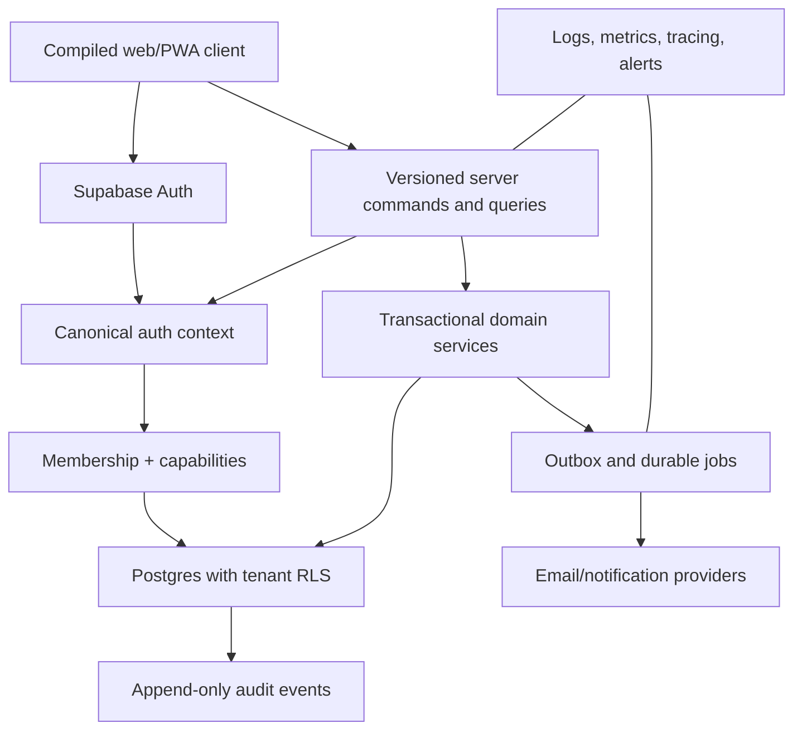

# Magnet OS target architecture

## Direction

Magnet OS will move from a browser-driven, single-agency JSONB application to a modular multi-tenant SaaS without a big-bang rewrite. Existing features remain available through a compatibility adapter while identity, tenancy, authorization, and core business domains move to normalized server-enforced models.

## Ownership hierarchy

Platform → Organizations/agencies → Organization members → Clients → Client operations.

A user may belong to multiple organizations. Platform administrators are separate from organization owners and receive no implicit tenant data access.

## Layers

1. **Identity:** Supabase Auth only; provider-native sessions and recovery.
2. **Authorization:** profile, active membership, organization, canonical role, capabilities.
3. **API/domain services:** validate commands, authorize, transact, emit audit/outbox events.
4. **Database:** normalized core domains, foreign keys, state checks, versioning, organization-scoped RLS.
5. **Jobs/integrations:** durable scheduled/retryable jobs and idempotent webhooks.
6. **Client:** data presentation, optimistic UX with version checks, offline drafts where safe; never the authorization boundary.

## Agency domains

- Agency dashboard and KPI definitions.
- Client HQ: overview, stakeholders, internal team, strategy, services, assets/integrations, activity.
- Magnet Flow: templates, instances, stages, transitions, assignees, deadlines.
- Content/deliverables, approvals, requests, meetings, decisions, reports.
- CRM, proposals, contracts, renewals.
- Team/HR, attendance, leave, performance, payroll with sensitive-data separation.
- Finance with capability-specific access.
- Files, notifications, comments, search, export and organization closure.
- SaaS control plane: plans, entitlements, subscriptions, usage, organization status, audited support tooling.

## Transitional compatibility

- Legacy `records` remains the source during initial additive phases.
- Mapping tables associate legacy IDs with normalized IDs and organization ownership.
- Dual-write is permitted only behind flags with mismatch metrics and idempotent server commands.
- New private reads never use the public key alone.
- A domain is cut over only after count/parity checks, browser tests, and rollback validation.

## Non-negotiable boundaries

- No service-role key in the browser.
- No frontend-only tenant or role enforcement.
- No organization/role values trusted from invite or CRUD payloads.
- No multi-row business transition as unrelated browser writes.
- No external tenant launch before RLS cross-tenant tests and recovery drill pass.
