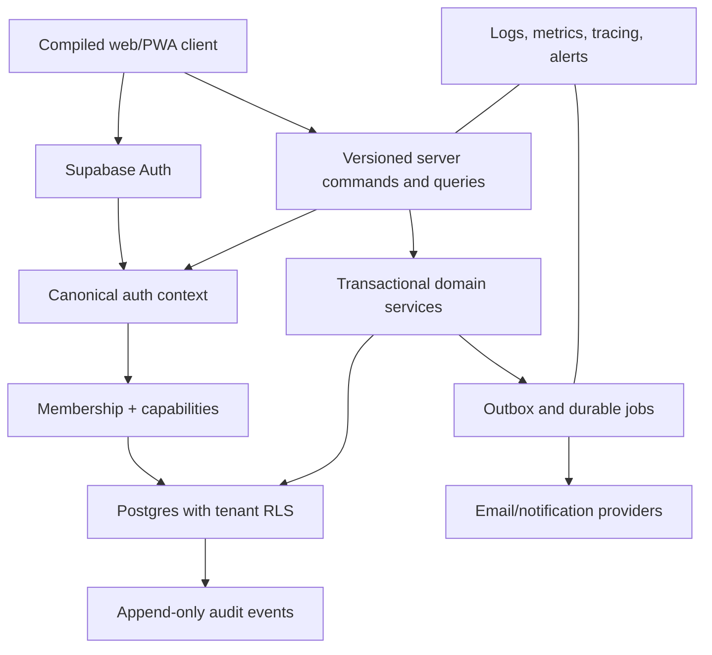

# Magnet OS target architecture

## Direction

Magnet OS will move from a browser-driven, single-agency JSONB application to a modular multi-tenant SaaS without a big-bang rewrite. Existing features remain available through a compatibility adapter while identity, tenancy, authorization, and core business domains move to normalized server-enforced models.

```mermaid
flowchart TB
  UI["Compiled web/PWA client"] --> AUTH["Supabase Auth"]
  UI --> API["Versioned server commands and queries"]
  AUTH --> CTX["Canonical auth context"]
  API --> CTX
  CTX --> RBAC["Membership + capabilities"]
  RBAC --> DB["Postgres with tenant RLS"]
  API --> TX["Transactional domain services"]
  TX --> DB
  TX --> OUTBOX["Outbox and durable jobs"]
  OUTBOX --> EMAIL["Email/notification providers"]
  DB --> AUDIT["Append-only audit events"]
  OBS["Logs, metrics, tracing, alerts"] --- API
  OBS --- OUTBOX
```

## Ownership hierarchy

Platform → Organizations/agencies → Organization members → Clients → Client operations.

A user may belong to multiple organizations. Platform administrators are separate from organization owners and receive no implicit tenant data access.

## Layers

1. **Identity:** Supabase Auth only; provider-native sessions and recovery.
2. **Authorization:** profile, active membership, organization, canonical role, capabilities.
3. **API/domain services:** validate commands, authorize, transact, emit audit/outbox events.
4. **Database:** normalized core domains, foreign keys, state checks, versioning, organization-scoped RLS.
5. **Jobs/integrations:** durable scheduled/retryable jobs and idempotent webhooks.
6. **Client:** data presentation, optimistic UX with version checks, offline drafts where safe; never the authorization boundary.

## Agency domains

- Agency dashboard and KPI definitions.
- Client HQ: overview, stakeholders, internal team, strategy, services, assets/integrations, activity.
- Magnet Flow: templates, instances, stages, transitions, assignees, deadlines.
- Content/deliverables, approvals, requests, meetings, decisions, reports.
- CRM, proposals, contracts, renewals.
- Team/HR, attendance, leave, performance, payroll with sensitive-data separation.
- Finance with capability-specific access.
- Files, notifications, comments, search, export and organization closure.
- SaaS control plane: plans, entitlements, subscriptions, usage, organization status, audited support tooling.

## Transitional compatibility

- Legacy `records` remains the source during initial additive phases.
- Mapping tables associate legacy IDs with normalized IDs and organization ownership.
- Dual-write is permitted only behind flags with mismatch metrics and idempotent server commands.
- New private reads never use the public key alone.
- A domain is cut over only after count/parity checks, browser tests, and rollback validation.

## Non-negotiable boundaries

- No service-role key in the browser.
- No frontend-only tenant or role enforcement.
- No organization/role values trusted from invite or CRUD payloads.
- No multi-row business transition as unrelated browser writes.
- No external tenant launch before RLS cross-tenant tests and recovery drill pass.

## Master directive alignment — 2026-09-25

The current static React/HTM app remains the shipping shell. The diagram above is
a target, not evidence of an existing compiled client. New modules acquire checked
interfaces and tests without replacing the monolith. See `CURRENT_SYSTEM_AUDIT.md`,
`DATABASE_ARCHITECTURE.md`, `MIGRATION_PLAN.md`, `OPEN_SOURCE_AUDIT.md`, and
`BUILD_PLAN.md` for current scope and gates.

Canonical client identity is the existing `client_accounts.id`; new audits,
strategy, content, Studio, social connections, and reports reference it with a
composite organization/client FK. `profiles` links to `auth.users`; membership and
capabilities remain separate. Preserve existing finance/HR roles and add missing
product-role capabilities through migrations, never a parallel permission engine.

Client HTTP/RPC calls converge on the existing canonical auth context. New domain
commands validate identity, active organization, capability, assignment/sharing,
expected revision and idempotency, then transact business changes plus audit/outbox.
PostgreSQL and object storage are shared authorities; browser storage is limited
to personal preferences and explicitly scoped disposable caches/drafts as each
legacy domain is migrated. It is never the new domain database.

The web/frontend remains Vercel-compatible. Durable workers claim PostgreSQL jobs
with leases and retries, independently of an open browser. Queue/Redis is optional;
add it only when measured workload needs it. Object storage has a provider adapter
and an isolated local development implementation. Uploaded bytes and social OAuth
secrets never enter the browser database or a Studio document snapshot.

Studio consumes typed structured snapshots with source entity/revision provenance,
then persists editable pages/blocks/versions under the same client. Export runs
from a versioned snapshot and reports progress/failure; a preview is not evidence
of a working PDF/PPTX export. The standalone local Studio is a reference, not a
second production system.

Meta/TikTok adapters will use official APIs, encrypted server-only tokens, OAuth
state/PKCE as required, signature-verified webhooks, and idempotent server publishing.
Demo adapters persist explicitly labeled demo results; they never return real
platform success. Analytics stores only sourced metrics with period/definition.
Optional AI defaults disabled, with independent Ollama and OpenAI-compatible
adapters; no core workflow waits on AI or requires a paid API.

Preserve existing dark/light tokens while extracting a documented spacing,
typography, radius, border, motion, icon and z-index scale. Keep desktop drawers
and keyboard-first tables; mobile prioritizes work, approvals, CRM lookup and
notifications. No wholesale visual replacement is part of the foundation increment.

## Compatibility is temporary, correctness is required

Legacy source defines evidence of business intent, not an architectural constraint.
Use the legacy compatibility matrix and reconciliation report to decide each cutover.
Keep identity maps and recoverable original values until per-field/relationship and
application acceptance pass. Never preserve a silent merge, authorization bypass,
client-side destructive retention, or browser-only business authority for compatibility.
