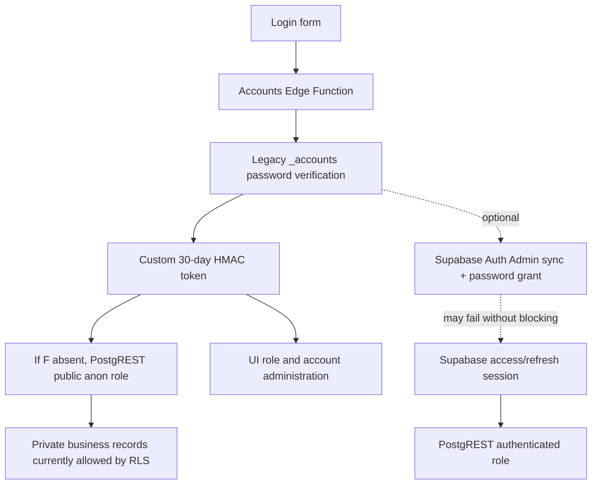
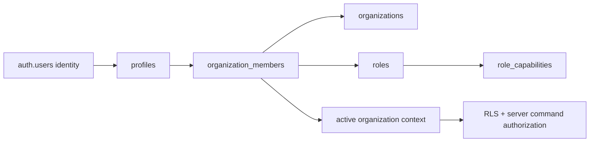

# Magnet OS authentication architecture

Status: audited 2026-08-16; target architecture proposed, migration not yet applied to production.

## Detected authentication stack

Magnet OS currently has two overlapping authentication systems.

### 1. Legacy account service — active source of login truth

- Provider: custom authentication in `supabase/functions/accounts/index.ts`.
- Account store: JSON objects in `public.records` where `coll = '_accounts'`.
- Passwords: PBKDF2-SHA256 verifiers, with legacy SHA/fallback verification and rehash-on-login.
- Session: custom HMAC token in browser local/session storage. Payload contains legacy user ID, role snapshot, and a 30-day expiration.
- Revocation: no per-token server record/version; disabling the user makes the `me` lookup fail, but already-issued tokens are otherwise stateless.
- Account actions: login, optional Auth bridge, list/save/delete, verify, password change, unlock, forgot password, and health.
- Rate limiting: non-atomic counters stored as `_ratelimit` rows.

### 2. Supabase Auth bridge — optional, not reliable as the authorization boundary

- Provider: Supabase Auth password grant and Admin API.
- Session store: `tia_sb_session` in localStorage.
- Activation: `_cfg-authv2` JSON record with `enabled` and allowed roles.
- Behavior: after legacy login, the Edge Function looks up or creates an Auth user, sets its password to the submitted legacy password, then returns an access/refresh session.
- Failure behavior: the application intentionally allows legacy login to succeed if Auth v2 fails. Private PostgREST requests then use the public key only.
- Production observation: the public probe found no visible `_cfg-authv2` row. The actual server-only Auth user/link state could not be inspected because Supabase project permissions were unavailable.

## Current session and data-access flow



This is the central P0: the application can display a legitimate user session while the database sees an anonymous caller.

## Current auth data and components

| Concern | Current implementation |
|---|---|
| Auth identities | Legacy `_accounts`; optional unlinked/loosely linked `auth.users` |
| Application profile | `employees` JSON records; not guaranteed for every account |
| Membership | None; single-agency assumption |
| Role | String duplicated in account, employee, session, and UI aliases |
| Invitation table | None as a canonical secure lifecycle |
| Account status | Mostly `Active`/other free-form strings and password flags |
| Middleware/protected routes | No server middleware; the SPA conditionally renders after local auth state |
| Cookies | None for the primary session; local/session storage tokens |
| Auth callback | No canonical provider callback route |
| Email verification | Legacy token field/action, not a complete provider-native lifecycle |
| Password reset | Temporary password sent by email, not a single-use reset-link flow |
| Webhooks | No authoritative Auth/email lifecycle webhook processing |
| Production URLs | App points to `https://magnet-op.vercel.app`; Supabase Site URL/redirect allow-list not verified |
| Environment | Public URL/key embedded; service-role/Resend/setup secrets live in hosting secrets when configured |

## Current legitimate-user failure points

1. Duplicate normalized email or username in legacy accounts. The Edge Function now fails closed with `identity-conflict`, but the user still needs admin repair.
2. Role changed in employee profile but not legacy account, cached session, or Auth metadata.
3. Account exists without `employeeId`, or employee points to a different legacy user.
4. Optional Auth identity is missing or duplicated. The local v13 candidate now paginates the Admin user list; production v11 does not yet contain that fix.
5. Auth bridge fails but UI login succeeds; later RLS changes would produce unexplained data loss/403s.
6. Temporary-password email is accepted by the provider but delayed/bounced, leaving the user unaware of the actual credential state.
7. Non-atomic rate-limit updates can undercount or produce hard-to-explain blocks.
8. Local storage preserves stale identity/role snapshots across deploys and tabs.
9. There is no organization membership state to resolve, diagnose, or recover.

## Target identity model

Supabase Auth becomes the only identity/session provider. Application tables remain authoritative for business access.



Proposed lifecycle states:

- `INVITED`
- `PENDING_VERIFICATION`
- `PENDING_SETUP`
- `ACTIVE`
- `SUSPENDED`
- `DISABLED`
- `ARCHIVED`

State is explicit and validated. Password age, nullable employee links, or email verification timestamps do not implicitly invent account status.

## Required invariants

1. One profile per `auth.users.id`.
2. Email is trimmed/lowercased for logical matching and diagnostic uniqueness.
3. A non-platform user has at least one valid active membership before private application access.
4. At most one membership exists for `(organization_id, user_id)`.
5. Membership role references a real organization role; permissions are capabilities, not string comparisons.
6. Active membership cannot reference a suspended/archived organization for normal access.
7. Invitation token is stored hashed, single-use, expiring, revocable, and binds intended email, organization, and role.
8. The server derives organization and role from the invitation and membership, never from browser fields.
9. Invite acceptance and account initialization are idempotent.
10. Authentication success is not application readiness; readiness requires profile + membership + active organization + capabilities.

## Canonical auth context

Every protected server operation resolves one context:

```text
request_id
auth_user_id
profile_id
account_status
memberships[]
active_organization_id
membership_status
role_id
capabilities[]
```

Resolution outcomes have one destination:

| State | Destination/action |
|---|---|
| No valid session | Login |
| Expired refresh | Clear session, return to login with `session_expired` |
| Pending verification | Verification/resend screen |
| Pending setup | Onboarding continuation |
| Missing profile/membership | Recovery screen + internal event; no redirect loop |
| Disabled user | Disabled-account screen |
| Suspended organization | Organization suspended screen or another active membership |
| Multiple memberships | Valid organization selector |
| Active context | Authorized dashboard |

## Signup and invitation transactions

Public self-signup should remain disabled until product rules are decided. Organization onboarding and invitation acceptance use server commands.

### New organization owner

1. Create/verify Auth identity using provider flow.
2. In one database transaction, create profile, organization, owner role/membership, onboarding state, audit event, and idempotency receipt.
3. If the provider operation succeeded but the database transaction failed, record a reconciliation incident and allow safe replay; never claim completion.

### Invitation acceptance

1. Hash the submitted token and lock the matching invitation row.
2. Validate expiry, revocation, intended normalized email, organization status, and unaccepted state.
3. Resolve the existing Auth identity or verified current session; do not create a second user for an existing email.
4. Upsert the unique organization membership with the invitation's server-side role.
5. Mark accepted and write audit/outbox events in the same transaction.
6. A repeated request returns the same membership result and creates nothing new.

## Password and session lifecycle

- Use Supabase Auth password reset/PKCE callbacks instead of emailing temporary passwords.
- Access tokens are short-lived; refresh tokens follow provider rotation/reuse rules.
- The browser never stores a service-role key and never sends/receives password hashes.
- Logout clears the local Supabase session and optionally uses global sign-out according to product policy.
- Password reset decides whether all other sessions are revoked and communicates this behavior.
- Redirects use an environment-validated allow-list for production, staging preview, and local development.

Required configuration checks:

- Exact production Site URL.
- Production reset/invite/verification callback URLs.
- Staging/preview wildcard only when intentionally safe.
- Local callback URL for development.
- Verified sender/domain, email templates, rate limits, CAPTCHA/risk policy as needed.
- Service-role/setup/email secrets only in server secret stores.

## Reconciliation diagnostics

The admin-only diagnostic must report, without secrets:

- Auth identity exists and verification state.
- Profile exists and account state.
- Legacy account link during migration.
- Employee link during migration.
- Memberships, organization status, role, and active organization.
- Pending/accepted/revoked invitations.
- Recent categorized auth events.
- Deterministic repair recommendation.

An offline/read-only reconciliation query reports:

- Auth identity without profile.
- Profile without Auth identity.
- Active profile without active membership.
- Duplicate membership.
- Invalid/missing role.
- Accepted invite without membership.
- Membership to missing/suspended organization.
- Duplicate normalized legacy email/username.
- Legacy account/employee role mismatch.

It never auto-deletes an account. Deterministic repairs are explicit, transactional, audited, and replay-safe.

## Observability and safe events

Events include `signup_started/completed/failed`, `login_succeeded/failed`, `invite_created/accepted/failed`, `verification_failed`, `membership_resolution_failed`, `session_refresh_failed`, password recovery events, and admin repairs.

Safe fields: request ID, event category, timestamp, user/profile/organization IDs when known, provider status, client version, and coarse IP/device risk where lawful. Never record passwords, password verifiers, access/refresh tokens, invitation/reset secrets, or sensitive profile data.

Metrics and alerts:

- Login/signup success and categorized failure rate.
- Invite acceptance failure/replay/expiry rate.
- Missing profile/membership incidents.
- Refresh failures and redirect-loop guard activations.
- Rate-limit blocks.
- Sudden RLS denials after deployment.

## Mandatory tests

- New identity initialization and duplicate submission.
- Valid/invalid/case-normalized login.
- New-user invitation, existing-user invitation, replay, expired/revoked/wrong-email invite.
- Missing profile/membership recovery state.
- Disabled user and suspended organization.
- Session expiry/refresh/logout/login again; no redirect loops.
- Password reset request, callback, expired/reused token, and old-session policy.
- Multi-organization selection.
- Agency A cannot read or mutate Agency B through browser, REST, RPC, or storage.
- Role update takes effect without stale cached privilege.
- Admin diagnostics reveal state but no secret fields.

## Migration sequence

1. Full backup/schema dump and staging restore.
2. Add organizations, profiles, memberships, roles/capabilities, invitations, auth/audit events.
3. Generate a dry-run identity reconciliation report.
4. Link unambiguous legacy accounts to Auth identities; manually decide conflicts.
5. Backfill the Magnet organization and memberships.
6. Introduce the canonical auth context and recovery UI behind a flag.
7. Run mandatory auth tests and role matrix in staging.
8. Require a valid Supabase session before private data load.
9. Enable tenant RLS and server command authorization, then disable legacy writes.
10. Remove temporary-password and password-sync bridge only after the migration cohort is stable.

Rollback before RLS enforcement is a feature-flag rollback. After enforcement, rollback requires the prior compatible app and prior policies together; never restore anonymous private access while the new app remains active. Legacy source rows are retained read-only during the observation window.

## Definition of done

Authentication is complete only when a test user and an invited user can finish the entire lifecycle in staging and production smoke; all historical accounts are diagnosable; no partial state is silent; tenant isolation passes; provider/email failures are visible; and administrators can repair deterministic inconsistencies from the product without an AI-written person-specific migration.
