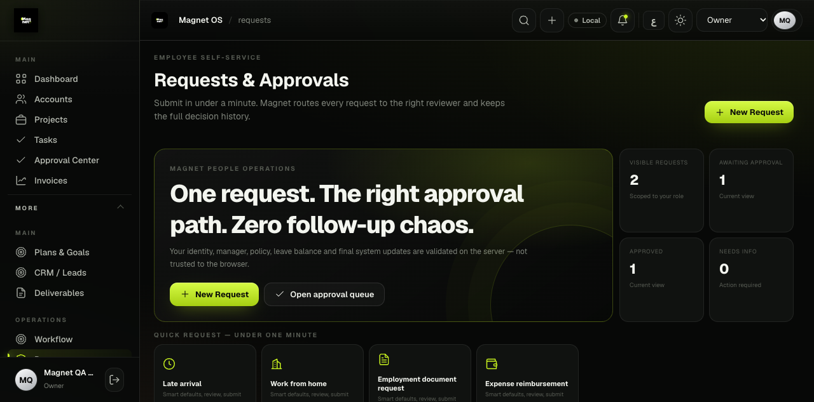
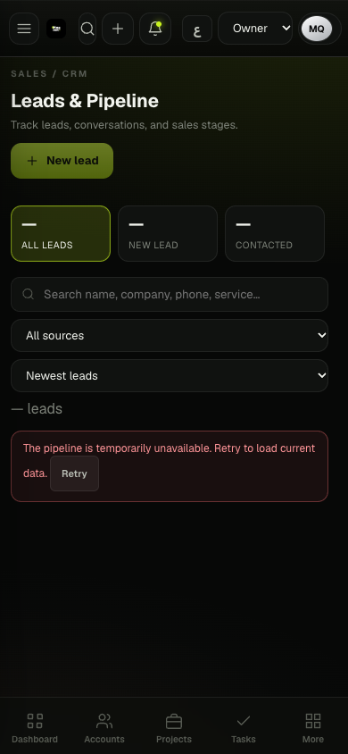
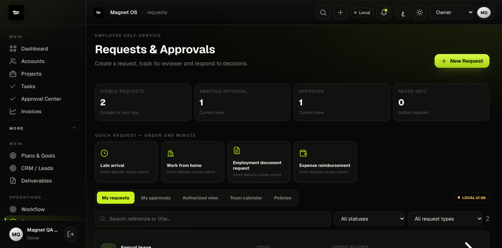
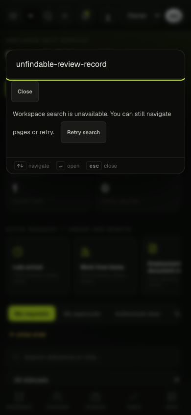
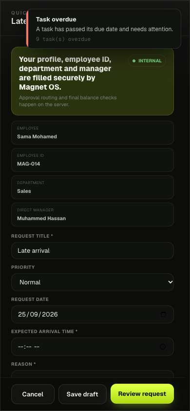

# Critical product audit — Magnet OS

2026-09-25. **No: Magnet could not safely discard operational spreadsheets and WhatsApp tomorrow.** The biggest problem is not missing screens; it is broken or unverified continuity between identity, commercial commitments, execution, approved versions and externally confirmed outcomes. This is an internal audit, not a production-readiness certificate.

## Evidence and limits

- Source: existing `index.html` views/helpers, `modules/`, `server/`, `api/`, edge functions, ordered SQL, release/test tooling and standalone Studio README. Existing architecture and data are evidence, not automatically correct.
- Read-only same-day snapshot: 73 public tables, 2,360 JSON records across 45 collections, 17 Auth users, 20 legacy accounts, one organization and one storage object. See [reconciliation](MIGRATION_RECONCILIATION_REPORT_2026-09-25.md). No production records changed. Snapshot is not transaction-consistent and does not back up object bytes or Auth secrets.
- Fresh local browser capture: Requests QA at 1280×633, CRM failure state desktop and 390×844. In-app browser opened normal boot and showed configuration-unavailable state; additional captures used the repository's browser-verification CLI. Requests data is explicitly synthetic; this is not a hosted employee session. No live authenticated production route was exercised. Source review of every major view does NOT mean visual verification of every screen.
- Current baseline tests include actual isolated PostgreSQL migrations and policy contexts plus many source assertions. Source assertions are not end-to-end coverage. Hosted Auth/Storage/email/social-provider tests need an independent configured staging environment.
- Competitor patterns: [official-source benchmark matrix](BENCHMARK_MATRIX.md). Scores below are conservative engineering assessments of demonstrated capability, not measured user research, competitor rankings or synthetic performance benchmarks.

## Ten strengths worth retaining

1. Actual business records and explicit legacy IDs exist; this is not an empty demo.
2. Consistent Magnet dark/lime identity and shared UI primitives support incremental change.
3. Arabic/English infrastructure and responsive styles exist, although parity is incomplete.
4. Canonical organization memberships and capability tables provide a usable authorization foundation.
5. Ordered SQL and server commands cover parts of clients, tasks, finance, storage and approvals.
6. Task commands include version checks, status transitions, comments and events.
7. Private document upload slots and metadata provide a better base than unrestricted URLs.
8. Recipient-specific notifications and an outbox exist; they can support a unified attention queue.
9. Read-only backup/reconciliation tooling now exposes discrepancies without silently rewriting them.
10. An isolated persistent PostgreSQL harness verifies real SQL behavior and restart/replay, beyond text matching.

## Twenty weaknesses, ordered by operational risk

| # | Priority | Finding / source evidence | Consequence | Repair gate |
|---|---|---|---|---|
| 1 | P0 | task_user_for_employee_v2 uses LIMIT 1; task_is_current_assignee_v2 accepts any legacy mapping in addition to explicit assignment | Ambiguous identity can select the wrong recipient or expand task access | Fail closed on ambiguity; explicit assignment wins; behavioral SQL denial tests |
| 2 | P0 | Live task status function omitted fresh active-membership check; local repair exists | Suspended assignee could retain a mutation path | Rehearse and deploy reviewed repair; revoked/suspended tests |
| 3 | P0 | Upload finalization/cancellation accepted stale uploader authority; local repair exists | Former uploader could mutate restricted documents | Fresh capability and document visibility checks; hosted byte verification |
| 4 | P0 | No independent hosted staging configured; production project is misleadingly labelled staging | Release testing could target real data | Enforced project-ref separation; representative staging rehearsal |
| 5 | P0 | Logical snapshot lacks storage bytes/Auth recovery material and managed encrypted recovery assurance | Successful row export is not complete disaster recovery | Restore drill and secured platform backups |
| 6 | P0 | Confirmed legacy/account mapping uncertainty remains; UI role aliases coexist with canonical roles | Wrong identity or privilege assumptions | Explicit reviewed mapping and complete deployed role matrix |
| 7 | P1 | convertLead creates/updates several records in browser | Retry/race/partial failure can duplicate onboarding | Transactional idempotent conversion |
| 8 | P1 | Projects, briefs, content relationships remain mostly JSONB | Database cannot enforce the agency chain consistently | Add canonical refs and reconcile before cutover |
| 9 | P1 | Calendar/deliverable Mark Published writes status without provider receipt | Team may believe work was delivered when it was not | Manual evidence state versus provider-confirmed result |
| 10 | P1 | runAutomation default branch records “Automation executed” without action | False success and forgotten work | Unsupported definitions cannot run; durable handlers later |
| 11 | P1 | driveAction reports sent immediately after triggerWebhook | A failed request can look delivered | Await verifiable delivery or show queued/unconfirmed state |
| 12 | P1 | CommandPalette catches RPC error as empty list | Users mistake outages for missing clients/tasks | Distinct unavailable state, retry and retained navigation |
| 13 | P1 | Studio keeps localStorage draft authority outside main identity/data model | Drafts can disappear and cannot reliably cross devices | Draft export/import then canonical versioned persistence |
| 14 | P1 | Asset/revision approval not universally bound to immutable content | Approval may not describe what is later published | Version hash, invalidation and final-file ownership |
| 15 | P1 | Follow-ups, meetings, proposals and client onboarding lack verified atomic handoffs | Manual re-entry and external trackers remain necessary | Canonical next actions and conversion events |
| 16 | P1 | Legacy/canonical notification stores differ | Missing or duplicated attention signals | Reconcile recipients/read state; one Inbox event pipeline |
| 17 | P2 | 1.53 MB index.html with intertwined render, auth, sync and workflow code | Broad regression surface and parsing cost | Measured incremental extraction, not rewrite |
| 18 | P2 | Radio injects YouTube iframe/API at login with default-on behavior | Background provider load and unexpected playback during work | Opt-in lazy player lifecycle |
| 19 | P2 | Navigation exposes dozens of peer destinations; Requests has a large marketing-style hero and repeated CTA | Attention competes with work; actual queue sits below fold | Role homes and compact operational hierarchy |
| 20 | P2 | Tiny metadata text, clickable div command options, partial translations and dense tables | Keyboard/screen-reader/mobile friction | Semantic controls, measured target/contrast checks and bilingual mobile tests |

## Ten workflow failures

1. Won lead → client/project/onboarding is not an atomic transaction; guarded browser matching is only partial protection.
2. Approved proposal → accepted commercial snapshot → signed contract → execution scope is not proven end to end.
3. Follow-up completion → next dated action/escalation is not a reliable durable chain.
4. Brief → audit/strategy → execution tasks loses version provenance and requires manual composition.
5. Assigned employee → one verified login is ambiguous for some legacy data; the assignment resolver must not guess.
6. Submitted creative → exact version → requested client reviewer → final approval lacks universal immutable binding.
7. Approved creative → scheduled platform variant is not an enforced state transition.
8. Scheduled content → provider-confirmed published post has no verified adapter/job/receipt chain.
9. Published post → attributable result → reproducible report is not established by manually entered metrics.
10. Report → renewal/upsell opportunity with owner and next action is not a verified durable handoff.

All ten have roadmap entries; none is marked solved by writing this report.

## Architecture, data and security risks

**Architecture:** dual write authorities (JSON records and projections), browser workflow side effects, unused typed tables that cannot yet be safely dropped, transient UI success before authoritative confirmation, prototype Studio, many source-based tests, scoped rather than monolith-wide lint/typechecking, generic legacy webhooks separate from durable outbox. Current static build manifest is a useful release inventory but deployment configuration still serves the root static project; audit artifacts must be excluded from deployment.

**Data:** 16 active child links point to deleted parents; these are review candidates, not permission to resurrect/delete/relink. Thirty-two lead records share normalized emails, which does not prove duplicate clients. One active payment lacks projection, one active account lacks an unambiguous Auth mapping, and one storage object is outside the document catalog. There are 304 unresolved task projection issue rows, 12 attached to nondeleted tasks; issue counts are not unique affected people. Exported enforced FK/key checks passed within their stated scope. JSON relationships and missing constraints are not vindicated by that result. No CHECK-expression or partial-index evaluation is claimed.

**Security:** server authorization must cover every path, not just the latest UI. Concrete task/upload issues have local repairs but are not deployed. Employee fallback identity is a further P0. Client-visible task and document scopes require negative-role tests. Legacy prune RPC remains available to privileged callers; browser auto-pruning was removed, but retention policy needs review. CSP still permits inline scripts; extraction is required before a strict CSP can replace it. A loaded page is not proof of session revocation, tenant isolation or safe upload handling. No claim of penetration-test completeness.

## Fake, manual and incomplete functionality register

| Surface | Actual behavior | Required interpretation |
|---|---|---|
| AI Agents | runAgentSim creates template-derived output; callModel returns null | Local draft simulator, not a model-backed agent; disclosure exists but page title still overstates it |
| Automation definitions outside auto-report/auto-invoice | Default branch reports generic execution | Unsupported handler; must not show completed success |
| Supported browser automation handlers | Create local/sync records from currently loaded data; not a durable scheduled worker | Manual browser action, not verified background automation |
| Calendar / deliverable Published | Manual record update | User-reported status, not confirmed external publication |
| Drive actions | Browser webhook plus immediate alert | External request has no demonstrated receipt |
| Studio | Browser-local document drafts/print | Prototype; not tenant-persistent collaborative document system |
| QA employee requests | Synthetic localhost-only owner/data | Useful UI fixture, not real Auth/RLS/persistence validation |
| Reports / performance fields | Manual and generated summaries, some whole-dataset counts | Not universally provider-backed analytics; retain source and period provenance |
| Workflow readiness | Heuristics such as any available asset satisfying onboarding | Guidance, not proof of complete onboarding or contractual execution |

## Visual findings and accessibility scope

The 1280×633 capture shows the repeated New Request action and a large promotional headline occupying the central work area. The actual request list is below the first viewport. Tiny all-caps secondary labels and dim explanatory copy reduce scanability. The navigation has strong brand consistency but combines finance, HR, delivery and utilities at one level. These are observable hierarchy issues, not a reason for a cosmetic redesign.

At 390×844, CRM's unavailable state reflows without document-level horizontal overflow; the retry is visible and creation is disabled. This is a correct outage state, not an empty pipeline. Only three stage cards fit at once; discoverability of the remaining horizontal stages needs real-device testing. Header controls and bottom navigation consume scarce space. Loaded records, keyboard zoom/reflow, screen-reader behavior and contrast ratios were not fully tested. No WCAG compliance claim.

## Click economy

Count activations from an already loaded relevant screen; typing and field-entry effort must be measured separately. Do not invent successful click counts where the backend is unavailable.

| Workflow | Current evidence / activations | Target and acceptance |
|---|---|---|
| Open task creation | Source: Create → New task → editor = 2; save not measured | One keyboard command or one visible action to editor; submit only after valid assignment |
| Assign task | Versioned task editor exists; authenticated completion blocked | One detail action + assignee + save; preserve conflict handling |
| Approve design | Source: Approval Center → item → Approve; complete flow not measured | Queue action plus explicit revision review; never remove evidence confirmation to save clicks |
| Find client | Browser Search button opens palette in 1 activation; RPC unavailable in QA | Cmd/Ctrl+K, query, Enter; failure cannot say no results |
| Update lead | CRM unavailable: correctly no mutation count | Inline stage action + required reason; owner/next action retained |
| Create proposal | Generic commercial form; no authenticated measured completion | Client/opportunity context prefilled; immutable sent revision |
| Schedule post | No verified provider-backed completion | Composer → approved revision → time/channel → schedule acknowledgement |
| Upload final asset | Upload RPC exists; hosted Storage unavailable | Contextual upload + explicit final version designation; confirm stored bytes |

## Internal module scores

F=functionality, U=UX, D=data model, R=reliability, P=performance, I=integration, M=mobile, Ready=production readiness. Each /10. Unverified deployed behavior is penalized, not optimistically assumed. Performance scores reflect code risk, not measured production latency. Scores precede this audit's remediation and do not increase automatically after a local patch.

| Module | F | U | D | R | P | I | M | Ready | Action / reason |
|---|---:|---:|---:|---:|---:|---:|---:|---:|---|
| Authentication | 5 | 5 | 6 | 4 | 5 | 5 | 5 | 3 | IMPROVE — dual lifecycle, staging gap |
| Users / employees | 5 | 4 | 4 | 3 | 5 | 4 | 4 | 3 | IMPROVE — identity ambiguity, restricted HR |
| Roles / permissions | 5 | 4 | 6 | 3 | 5 | 4 | 4 | 3 | MERGE — canonical capability authority |
| Workspaces | 4 | 4 | 6 | 4 | 5 | 4 | 4 | 3 | IMPROVE — multi-workspace lifecycle unverified |
| Clients | 6 | 5 | 6 | 4 | 5 | 4 | 4 | 4 | MERGE — one client aggregate |
| Contacts | 3 | 4 | 3 | 3 | 5 | 2 | 4 | 2 | IMPROVE — explicit links |
| CRM / leads / pipeline | 6 | 5 | 5 | 4 | 5 | 3 | 5 | 3 | IMPROVE — transactional handoffs |
| Follow-ups / activities | 3 | 4 | 3 | 3 | 5 | 2 | 4 | 2 | MERGE — opportunity timeline |
| Proposals / quotations | 4 | 4 | 3 | 3 | 5 | 2 | 3 | 2 | MERGE — versioned commercial documents |
| Contracts | 4 | 4 | 5 | 4 | 5 | 2 | 4 | 3 | IMPROVE — signing evidence |
| Projects | 5 | 4 | 3 | 4 | 4 | 3 | 4 | 3 | IMPROVE — canonical project refs |
| Briefs / knowledge | 5 | 4 | 3 | 4 | 5 | 3 | 4 | 3 | MERGE — versioned knowledge |
| Tasks / My Work | 6 | 5 | 5 | 3 | 5 | 4 | 4 | 3 | IMPROVE — assignment security, execution view |
| Approvals / revisions | 5 | 4 | 4 | 4 | 5 | 3 | 4 | 3 | MERGE — exact revision decisions |
| Files / assets | 4 | 4 | 3 | 3 | 4 | 2 | 3 | 2 | MERGE — one asset catalog |
| Storage | 5 | 4 | 6 | 3 | 5 | 4 | 4 | 3 | IMPROVE — fresh permissions, byte tests |
| Studio | 3 | 5 | 1 | 2 | 5 | 1 | 3 | 1 | REBUILD — persistence boundary |
| Audit / strategy | 2 | 3 | 2 | 2 | 5 | 1 | 3 | 1 | IMPROVE — versioned execution input |
| Content / campaigns | 4 | 4 | 3 | 3 | 4 | 2 | 4 | 2 | MERGE — canonical variants |
| Publishing | 1 | 3 | 1 | 1 | 4 | 1 | 3 | 1 | REBUILD — job/receipt authority |
| Calendar | 5 | 4 | 3 | 3 | 4 | 2 | 4 | 2 | KEEP view; IMPROVE schedule authority |
| Notifications / Inbox | 5 | 4 | 5 | 4 | 5 | 3 | 4 | 3 | MERGE — recipient event pipeline |
| Chat / comments | 4 | 4 | 3 | 3 | 4 | 2 | 4 | 2 | MERGE — contextual collaboration |
| Global search / commands | 5 | 4 | 5 | 3 | 5 | 3 | 4 | 3 | IMPROVE — truthful errors, coverage |
| Founder / role homes | 4 | 3 | 3 | 3 | 4 | 2 | 3 | 2 | IMPROVE — actionable exceptions |
| Radio | 5 | 4 | 6 | 3 | 2 | 4 | 4 | 3 | KEEP — opt-in resource lifecycle |
| Reports | 4 | 4 | 3 | 3 | 4 | 2 | 3 | 2 | IMPROVE — source/time lineage |
| Finance | 6 | 4 | 5 | 4 | 5 | 3 | 4 | 3 | IMPROVE — payment reconciliation |
| Employee requests | 5 | 5 | 6 | 4 | 5 | 4 | 5 | 3 | IMPROVE — deployed schema/auth proof |
| Settings | 5 | 4 | 5 | 4 | 5 | 3 | 4 | 3 | MERGE — canonical vs personal scopes |
| Integrations / outbox | 4 | 3 | 5 | 3 | 5 | 3 | 3 | 2 | IMPROVE — receipt-backed adapters |
| Automations | 2 | 3 | 2 | 2 | 4 | 2 | 3 | 1 | REBUILD — durable execution |
| AI helpers | 2 | 3 | 2 | 2 | 5 | 1 | 2 | 1 | DEPRECATE AI claims; retain labelled templates |
| Backup / recovery | 5 | 3 | 5 | 4 | 5 | 3 | 2 | 3 | IMPROVE — full restore rehearsal |
| Arcade / leaderboard | 3 | 4 | 3 | 3 | 4 | 1 | 3 | 2 | DEPRECATE priority — no core workflow benefit |

## Missing capability and technical-debt decision

Missing: atomic commercial onboarding, canonical opportunities/contacts/projects, recurring tasks/dependencies, revision-bound creative approval, authenticated Studio persistence, provider publishing receipts, source-backed reports/renewals, unified attention and verified role homes. Debt: monolith, duplicate authorities, browser side effects, inconsistent statuses/translations, partial semantic markup, narrow static tests, deployment/source drift. All are ordered in [the remediation roadmap](REMEDIATION_ROADMAP.md). Preserve business evidence while replacing these mechanisms; no cleanup deletion is authorized by this audit.

## Remediation implemented during this review

The findings and scores above describe the audited baseline. Subsequent local changes:

- P0 task identity: reproduced explicit-assignee bypass, added fail-closed resolver and behavioral RLS/detail tests. [Repair and rollout limits](TASK_IDENTITY_REPAIR.md).
- P1 conversion: replaced browser multi-write conversion with a versioned transaction, retry behavior, concurrency test and rollback test. [Scope and compatibility](ATOMIC_LEAD_CONVERSION.md). Full opportunity/project orchestration and durable webhooks remain open.
- P1 truthful operations: unsupported automation definitions cannot write success; supported tools are labelled manual. Invoice reminders exclude settled/cancelled/draft/deleted invoices; manual reports disclose loaded-data scope. Webhooks report HTTP acceptance or unconfirmed/rejected delivery, never guaranteed file creation.
- P1 search: outage differs from no match, navigation remains usable, retry retains focus, Escape closes and restores launcher focus. Dialog/combobox/option semantics added; no full accessibility certification.
- P1 mobile discovery: bottom navigation at z-index 90 covered modal actions at 80. Overlay now sits above navigation. At 390×844, Review is clickable, missing required fields show an error, and Cancel closes the form.
- P2 Requests: duplicate promotional hero/CTA removed; one create action remains. At the same 1280×633 viewport, list starts at y≈588 rather than y≈769 (about 182 pixels earlier). Existing picker/quick-request/approval tabs remain available. Error states suppress false zero totals/empty results.
- P2 Radio: no iframe before opt-in; Play creates one; Pause destroys it and persists off. Existing explicit on/station/volume preferences remain supported.
- Release integrity: changed module/style URLs are versioned to avoid receiving a previous cached module with new HTML. Audit docs/screenshots are excluded from Vercel upload.

The mobile fixes were verified on the synthetic QA flow, not a hosted employee submission. No request was submitted to production. No migration or application deployment was performed. See [verification evidence](PRODUCT_REVIEW_VERIFICATION.md).
