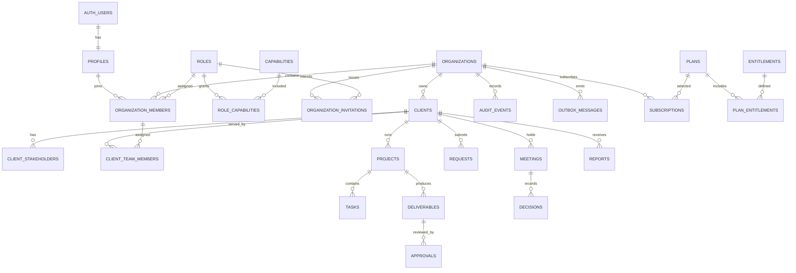

# Magnet OS target database ERD

This is the conceptual normalized target. It is not yet the live schema.

All tenant business entities carry or enforce organization ownership. Sensitive employee/finance details are intentionally omitted from the broad ERD and belong in capability-protected one-to-one/child tables.
