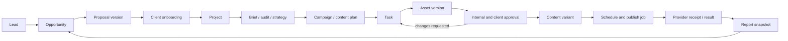

# Ideal agency data flow

This is a target contract. The current complete chain has NOT passed an end-to-end test.

| Transition | Data retained / linked | Atomic result and invariant | Current missing proof |
|---|---|---|---|
| Outreach → lead → opportunity | source/campaign, consent provenance where relevant, contact IDs, owner, initial notes | Idempotency key; unique external source ID when available; no email-based automatic entity merging | Canonical opportunity and outreach lineage |
| Opportunity → follow-up → meeting | original lead/contact, action owner, due instant/timezone, completion outcome | Completing action can create an explicit next action in same transaction; cancellation recorded | Durable next-action chain and missed-follow-up queue |
| Opportunity → proposal → negotiation | client/contact refs, scope, currency, line prices, discount authority, revision | Immutable sent snapshot; later edits create new revision | Proposal version and approval/signature evidence |
| Won → client → project | opportunity ID, accepted proposal revision, selected existing client or explicit new client, account owner, scope | One conversion command with stable key, lock/version check, client/project/onboarding/event creation or no change | Current browser conversion can partially finish or race |
| Project → brief → audit → strategy | canonical client/project, approved scope, brief version, references, findings | Templates instantiate tasks by stable source key; retries do not duplicate work | No verified canonical brief-to-execution generation |
| Strategy → campaign → tasks | objective, metric definitions, dates, budget references, content plan revision | Task references campaign/project/brief and eligible assignee; dependencies cannot cycle | Legacy mixed IDs and ambiguous employee mapping |
| Task → asset | task/client/project IDs, creator, storage object/version/hash, media metadata | Upload authorization checked at start and finalize; missing bytes cannot become ready asset | Hosted Storage bytes and catalog reconciliation |
| Asset → internal review → client review | exact asset/content revision, reviewer identity, request ID, due date, decisions/comments | Approval uses expected version; editing invalidates downstream approval; rejection has reason | Version-pinned creative approval, client receipt |
| Revision → final → content variant | prior versions, resolved feedback, final asset version, caption/language/platform | Final pointer changes through authorized command; history retained | Separate deliverable/calendar status does not enforce this |
| Approved variant → schedule → publish | approval revision/hash, exact scheduled UTC + source timezone, connection, attempt key | Lease + retries; revoked connection blocks; unknown provider result reconciled before retry; no duplicate post | Provider adapters and approved live credentials |
| Publish → result → report | provider post ID/URL, confirmation time, observation window, metric source/units, client/campaign | Manual observation labelled; append-only observations; reproducible report snapshot | Published boolean and entered totals do not prove provider results |
| Report → renewal/upsell | report revision, accepted findings, next action, new opportunity | Keep original engagement; new sales cycle references it, never overwrites old deal | Durable renewal handoff |

## Employee lifecycle

Invite → verified Auth identity → explicit profile → active organization membership → role/capabilities → explicit employee mapping → assigned work → recipient notification → execution → logout/session restoration. Never choose the first membership or infer identity from email/name. Suspended membership denies reads and mutations even if task assignment or cached UI still exists. Canonical assignment takes precedence over legacy fallback; ambiguous mappings grant nobody fallback access.

## Migration and reconciliation contract

1. Snapshot public rows/schema/auth inventory/storage references with checksums and access controls; separately secure recovery coverage for actual Auth and object bytes.
2. Restore a representative copy in independent staging, never the production project merely labelled staging.
3. Add nullable canonical references and explicit mapping/issue ledgers. Preserve original source rows; record ambiguous cases for human review.
4. Compare counts by active/deleted status, full-row hashes, relationships, tenant ownership, user mappings, required fields, constraints, duplicates and storage references before/after. SQL success alone is insufficient.
5. Exercise both agency and employee lifecycles with two tenants and least-privilege roles, concurrent retries, stale versions, provider failures and restart persistence.
6. Cut over a domain's writes only after parity; keep compatible reads and rollback evidence. Production rollout requires named target, verified recovery, tested rollback and authorization where destructive. No domain is safe to drop because its new table exists.

See [the actual reconciliation report](MIGRATION_RECONCILIATION_REPORT_2026-09-25.md) for counts, ambiguity and limits. This flow does not assert those migrations have happened.
